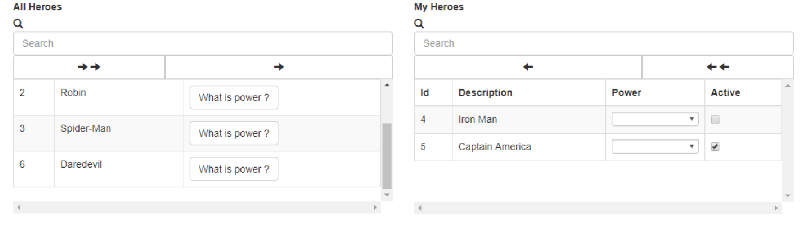

# dual-pick-list-ng / Angular 2+

[](https://raw.githubusercontent.com/caiquevallim/dual-pick-list/master/LICENSE)


## Demo

In Maintenance




## Table of contents

- [About](#about)
- [Installation](#installation)
- [Documentation](#documentation)
- [Development](#development)
- [License](#license)

## About

The dual-pick-list-ng has been created for help us to create a dual list box fastest in Angular 2+.

## Installation

Install through npm:
```
$ npm install bootstrap@v3.3.6 --save
$ npm install bootstrap-duallistbox --save
$ npm install dual-pick-list-ng --save
```

Then include in your apps module (app.module.ts):

```TypeScript
//..//
import {DualPickListModule} from 'dual-pick-list-ng';
//..//
@NgModule({
  declarations: [
    //..//
  ],
  imports: [
    //..//,
    DualPickListModule,
    //..//
  ]
})
export class AppModule { }
```

Finally use in one of your apps components:

You're going to need to include in your HTML 5 file the following statment:
```HTML 5
    <app-dual-pick-list
        [list]="items"
        [headerConfig]="headerConfig"
        [placeHolder]="'Search By...'"
        [textKeyLeftList]="'Not Selected'"
        [textKeyRightList]="'Selected'"
        (onTransaction)="OnTransaction($event)">
    </app-dual-pick-list>
```

## Documentation
* Bindings:
    * `[list]` : `Array<YourCustomListModel>`. This bind is `required`.
    * `[headerConfig]` : `YourCustomHeaderModel`. This bind `required` and it's used to you setup header of your left list and header of your right list.
    * `(onTransaction)` : ` ()=>{}`. This bind `required`, when any event is dispatched, you can get left list and right list through the dual-pick-list component.
    * `[textKeyLeftList]` : `String leftLabel`. Name of left table. This bind is not `required`. It has a value `Not Selected` as default.
    * `[textKeyRightList]` : `String rightLabel`. Name of right table. This bind is not `required`. It has a value `Selected` as default.
    * `[placeHolder]` : `String placeholder`. Search input left and right.

* Models:
    * `YourCustomListModel`. It should be extends of ItemDualPickListModel from import {ItemDualPickListModel} from 'dual-pick-list-ng';
        * property `left : Boolean of ItemDualPickListModel Class` When it is `true` then the item will be located on left list
        * property `right : Boolean of ItemDualPickListModel Class` When it is `true` then the item will be located on right list
        * property `fieldOfYourInterest` : For example: `cdClient`, `descClient` or any other that you will need.
        * constructor you will have to get a this.super() in this model to give some value for left and right from ItemDualPickListModel.

    * `YourCustomHeaderModel`
        * property `left : Array<HeaderDualPickListModel>`
        * property `right : Array<HeaderDualPickListModel>`
        
    * `HeaderDualPickListModel`
        * property `text : String`. Name of the column.
        * property `key : String` This property should contain the name that you have been past on `Item.fieldOfYourInterest` property above
        * property `custom : Boolean` : `true` for you use some components in your records of this column
        * property `select : ObjectSelect`: It can not be `true` if `custom` has `false`
        * property `checkbox : Boolean`: It can not be `true` if `custom` has `false`
        * property `button : ()=>{}` Function which can manipulated the current item or any other events that you need. It can not be `true` if `custom` has `false`

    * `ObjectSelect`
        * property `list : ArrayList[ObjectSelect]` : This list should be mapped as `ObjectSelectItem`

    * `ObjectSelectItem`
        * property `id : number/long/int`: Id
        * property `text : String`: Name


## Development

### Prepare your environment
* Install [Node.js](http://nodejs.org/) and NPM
* Install local dev dependencies: `npm install` while current directory is this repo

## License

MIT
